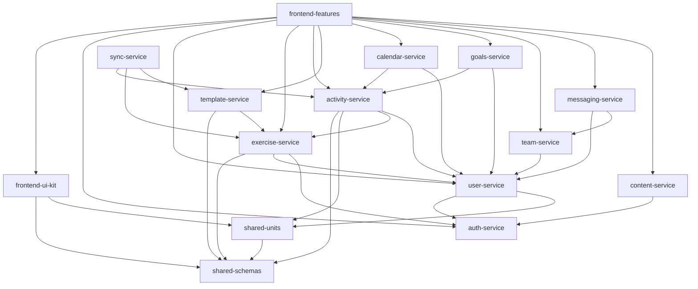

DELETE

# Organizer — Library Decomposition Overview

This document describes the Organizer product as it exists today and proposes a decomposition of the current monolithic codebase into **15 independently-buildable libraries**. Each library has its own requirements document linked at the bottom of this file.

This document expands on [`docs/FEATURES_OVERVIEW.md`](../docs/FEATURES_OVERVIEW.md) and is intended as a planning artifact only — no code is being moved or refactored as part of producing this document set.

---

## 1. Product Summary

Organizer is a full-stack **workout, training, and rehabilitation platform** that lets athletes, coaches, trainers, and physiotherapists design, plan, log, and analyze physical activity. It is intended for a broad audience:

- **Athletes** running periodized training cycles.
- **Fitness enthusiasts** mixing cardio, strength, mobility, and HIIT.
- **Coaches & trainers** managing multiple clients via shared templates.
- **Physiotherapists** prescribing rehab exercises and tracking compliance.

### Core capabilities (what the product does today)

- **Workout templates** — JSON-defined, reusable training structures supporting sections, supersets, circuits, AMRAP/EMOM, pyramids, periodization and recurrence. Templates are version-controlled (`template_id` + `version`) and stored in `activity_templates`.
- **Activity planning** — Templates can be scheduled to specific dates/times via `planned_activities`, with recurrence rules (RRULE), exception dates, and grouping into `periods`.
- **Activity logging** — Athletes record what they actually did. Logs combine relational rows (`activity_logs`, `workout_log_exercises`) with flexible JSONB performance data (sets, reps, weight, tempo, RPE, distance, duration, pace, etc.). Free-form (no-template) logging is supported.
- **Exercise catalog** — Canonical exercises with aliases (`exercise_aliases`), muscle groups, equipment, complexity ratings, exertion definitions, and shareable exercise templates.
- **Progress tracking & metrics** — Performance history, charts of volume / weight / estimated 1RM, filterable by date and exercise.
- **Milestones & badges** — Schedulable milestones inside training periods; completion is logged and may award `badges`.
- **Calendar views** — Day, week, month, and year browsers; ICS feed support.
- **Teams & sharing** — Named teams, memberships, team tags. Templates, exercises, and exercise templates can be shared with users or teams via dedicated share tables.
- **User preferences & parameter visibility** — Per-user units, interest tags, and fine-grained rules controlling which exercise parameters are visible or loggable per category (mutually-exclusive visibility groups, log groups).
- **Articles & help content** — In-app help drawer plus markdown articles served from the backend.
- **Authentication** — OAuth2 with JWT bearer tokens, plus guest cookie sessions.
- **Offline sync helpers** — Functions for synchronizing with an offline database (planned for the desktop/CLI workflow).
- **Messaging (Phase 0, stubbed)** — README and `FEATURES_OVERVIEW.md` describe a real-time messaging subsystem with DMs, groups, team broadcasts, practitioner↔patient E2EE, and S3 attachments. Today this is gated behind `MESSAGING_ENABLED` / `VIDEO_MESSAGING_ENABLED` feature flags and is largely unimplemented.
- **CLI tooling** — `scripts/import_template.py`, `scripts/export_template.py`, `scripts/manage.py` for import/export, setup, DB build, and CSV round-trip.

---

## 2. Architecture Today

Single FastAPI process + single React/Vite SPA, sharing one database.

| Layer       | Technology                                                |
|-------------|-----------------------------------------------------------|
| Backend     | FastAPI, SQLAlchemy, Alembic (single consolidated `0001_initial.py`) |
| Frontend    | React (JSX), Vite, MUI, React Hook Form, Recharts         |
| Database    | TimescaleDB (PostgreSQL) in production; SQLite for local  |
| Auth        | OAuth2 + JWT (FastAPI), guest cookie fallback             |
| Storage     | S3 for messaging attachments (when enabled)               |
| CI/CD       | GitHub Actions                                            |

Backend layout: `app/routers/` (27 routers), `app/services/` (10 service modules), `app/schemas/` (Pydantic), `app/models/` (SQLAlchemy), `app/dependencies/`, `app/utils/`, `app/activity/`, `app/templates/`, `app/articles/`, `app/api/v1/`. JSON Schemas for activity payloads live in `schemas/activity/v1/` and `schemas/user/v1/`.

Frontend layout: `frontend/src/` is mostly flat with ~70 page-level `.jsx` components. A `components/` folder holds shared widgets and a `features/exercises/` folder hints at an in-progress feature-package convention. There is no monorepo / workspace structure today.

There is **no current modularization** — all code ships from one Python package and one Vite bundle.

---

## 3. Decomposition Rationale

The chosen split is **hybrid**:

- **Tier 1 — shared cross-cutting libraries** for things consumed by both backend and frontend (JSON schemas, units/conversions). These are the natural seams: schemas already live in a top-level `schemas/` directory and units are already a normalized DB concept.
- **Tier 2 — backend service libraries** carved along the existing router/service boundaries. Each library owns a coherent set of routers, services, and the SQLAlchemy tables underneath them.
- **Tier 3 — frontend libraries** split into a shared UI kit (today's `frontend/src/components/`) and per-domain feature packages (mirroring the backend domains).

This split maximizes reuse where it matters (schemas and units are genuinely cross-cutting), while keeping backend domains as vertical owners of their data model and not entangling them with frontend concerns. It avoids both extremes: a single full-stack lib per domain (which forces backend and frontend release cadences to lock together) and a strict horizontal split (which scatters domain logic across tech-layer libraries).

---

## 4. Library Catalog

| # | Library | Tier | Purpose | Primary consumers | Key deps |
|---|---|---|---|---|---|
| 1 | [shared-schemas](shared-schemas.md) | 1 | JSON Schemas + generated types for activities, measurements, templates | Everything | — |
| 2 | [shared-units](shared-units.md) | 1 | Measurement units, conversions, user-scoped unit preferences | activity-, exercise-, user-service; frontend-features | shared-schemas |
| 3 | [auth-service](auth-service.md) | 2 | OAuth2/JWT, guest cookie sessions, login/signup/logout | All authenticated services | — |
| 4 | [user-service](user-service.md) | 2 | Users, preferences, parameter visibility/log rules, interests | activity-, exercise-, calendar-service; frontend-features | auth-service, shared-units |
| 5 | [exercise-service](exercise-service.md) | 2 | Exercise catalog, aliases, tags, categories, complexity, equipment, muscles, exercise templates | activity-, template-service; frontend-features | shared-schemas, user-service, auth-service |
| 6 | [activity-service](activity-service.md) | 2 | Planned activities, activity logs, workout log exercises, metrics, strength calcs | template-, calendar-, goals-service; frontend-features | shared-schemas, shared-units, exercise-service, user-service |
| 7 | [template-service](template-service.md) | 2 | Activity templates, version history, CLI import/export | activity-service; frontend-features; CLI | shared-schemas, exercise-service |
| 8 | [calendar-service](calendar-service.md) | 2 | Calendar views, periods, recurrence rules + exceptions, tasks/appointments | activity-, goals-service; frontend-features | activity-service, user-service |
| 9 | [goals-service](goals-service.md) | 2 | Planned milestones, milestone log, badges | frontend-features | activity-service, user-service |
| 10 | [team-service](team-service.md) | 2 | Teams, memberships, team tags, share permissions | exercise-, template-service; frontend-features | user-service |
| 11 | [messaging-service](messaging-service.md) | 2 | DMs, group chats, team broadcasts, attachments, E2EE for practitioner↔patient *(Phase 0, stubbed)* | frontend-features | user-service, team-service |
| 12 | [sync-service](sync-service.md) | 2 | Offline-first DB sync helpers and CLI flows | CLI; future mobile/desktop | activity-, exercise-, template-service |
| 13 | [content-service](content-service.md) | 2 | Articles, help content/contexts, system log | frontend-features | auth-service |
| 14 | [frontend-ui-kit](frontend-ui-kit.md) | 3 | Reusable React components, form inputs, layout, theming, API client, React Query setup | frontend-features | shared-schemas, shared-units |
| 15 | [frontend-features](frontend-features.md) | 3 | Per-domain React feature packages (auth, templates, activities, calendar, progress, messaging, settings, teams) | App shell | All Tier 1 + 2 + frontend-ui-kit |

---

## 5. Dependency Diagram

Rule: arrows point from consumer to dependency. Tier 1 libraries depend on nothing in the system. Tier 2 backend libraries may depend on Tier 1 and on each other only as shown. Tier 3 frontend libraries may depend on anything below them.

---

## 6. Index — Per-Library Requirements

### Tier 1 — Shared
- [shared-schemas](shared-schemas.md)
- [shared-units](shared-units.md)

### Tier 2 — Backend services
- [auth-service](auth-service.md)
- [user-service](user-service.md)
- [exercise-service](exercise-service.md)
- [activity-service](activity-service.md)
- [template-service](template-service.md)
- [calendar-service](calendar-service.md)
- [goals-service](goals-service.md)
- [team-service](team-service.md)
- [messaging-service](messaging-service.md)
- [sync-service](sync-service.md)
- [content-service](content-service.md)

### Tier 3 — Frontend
- [frontend-ui-kit](frontend-ui-kit.md)
- [frontend-features](frontend-features.md)
